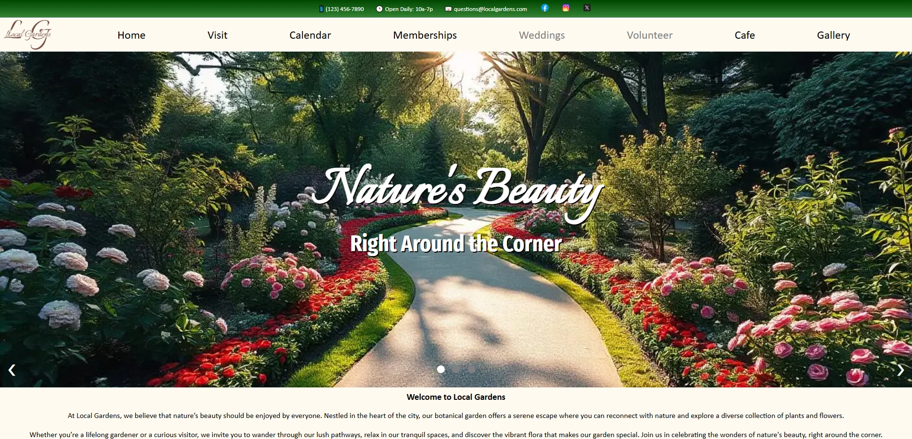

<h1>Overview</h1>

This is a static website representing a fictional garden, made using basic HTML, CSS, Sass, and JavaScript as part of a goal to teach myself how to design a professional website.

It is an earlier project of mine with which I started learning web development, and as such there are many things I would do differently now given the knowledge and skills I've gained in the time since.

The website itself has a few interesting features, including a custom-built JavaScript event calendar, a working photo gallery, and informational sections that would typically be seen in a real website. It was designed with thoughtfulness in regard to color scheme, UI/UX design choices, and a potential target audience.

Some pages are unfinished (Weddings, Volunteer, Cafe, and backend integration for Memberships), but I hope to revisit this project idea and refine it at some point. However, I do like the idea of keeping this project in its current state, as it shows the progress I've made since the point in which it was actively worked on (August 2024.)

It's not perfect, and I can see a lot of room for improvement, but this project helped me immensely with diving into web development, and overall I feel very satisfied with how it turned out!

The website can be viewed <a href="https://matthewpendergast.github.io/garden-website/index.html">here</a>.

</img>